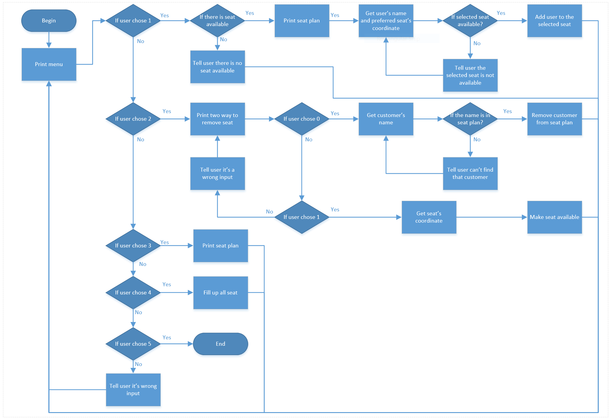
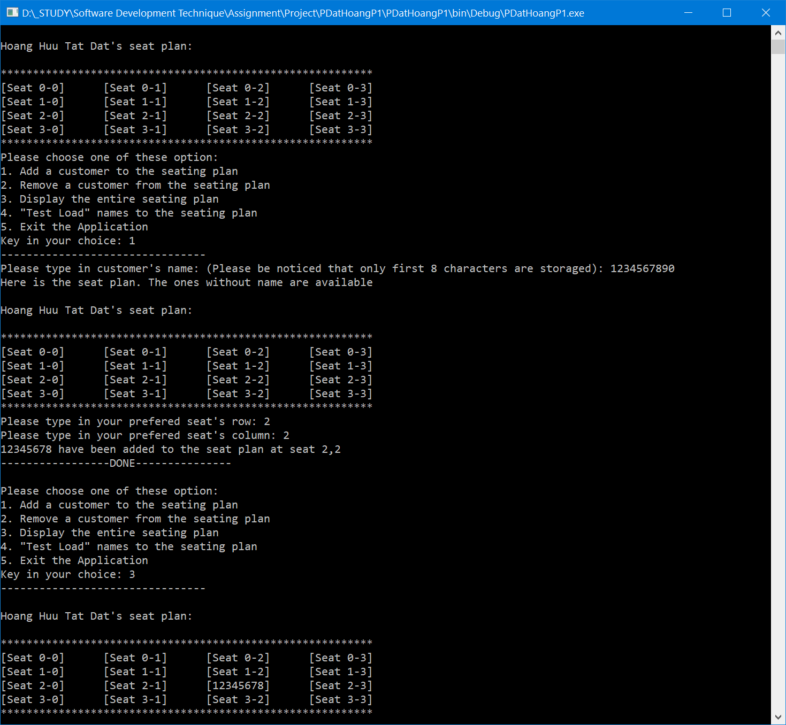
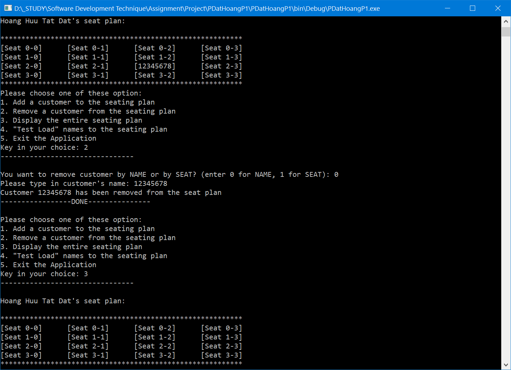
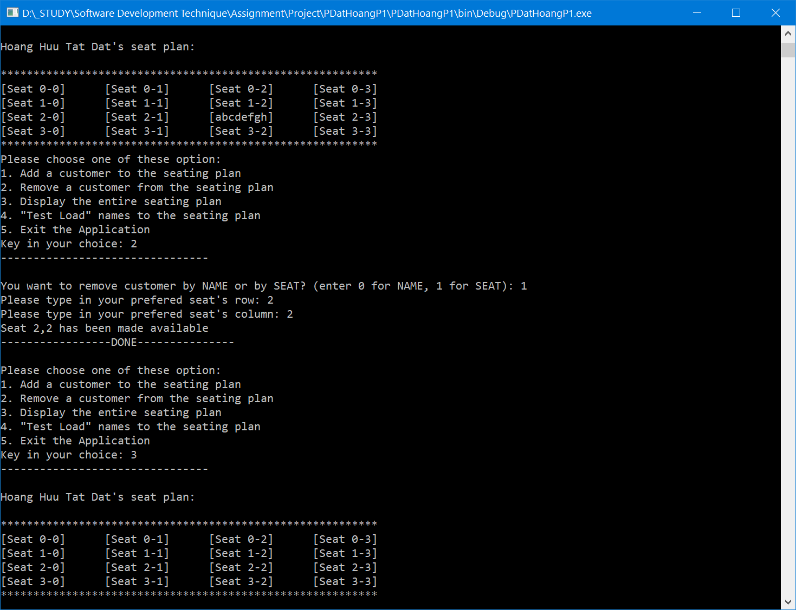
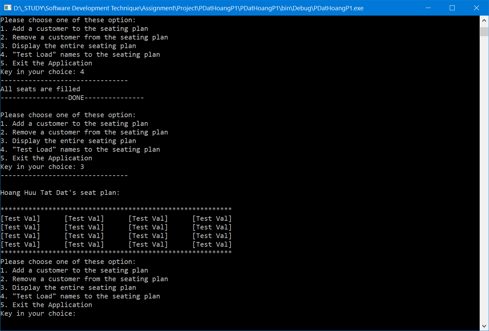

# CS_Console_SeatPlan
A C# console program to manage seats in a seat plan.
The program has a 4 option menu:
1. Add customer
2. Remove Customer
3. Display the seat plan
4. Flood the seat plan with abstract guest
5. Exit

All the in correct input from user were handled to make sure the program runs the way it's designed.

